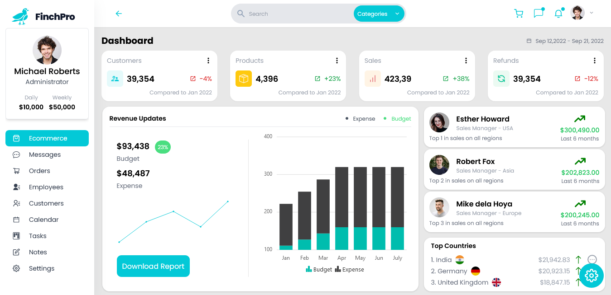
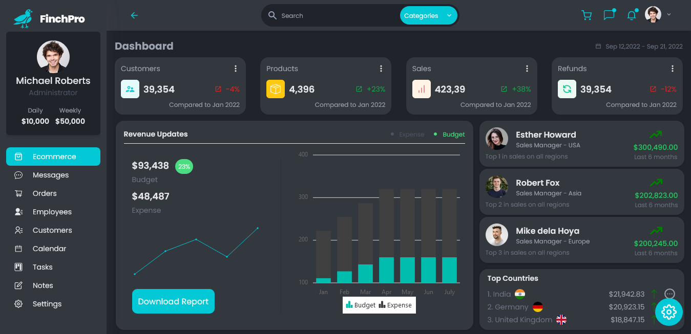
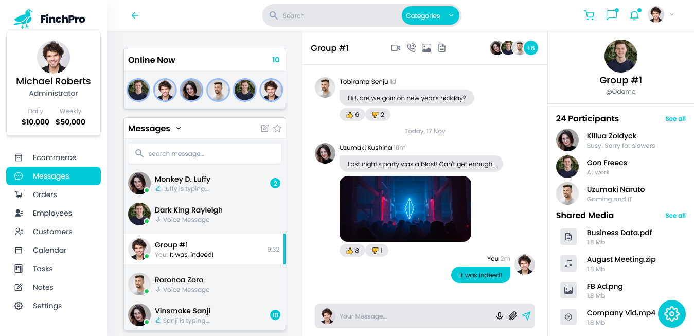
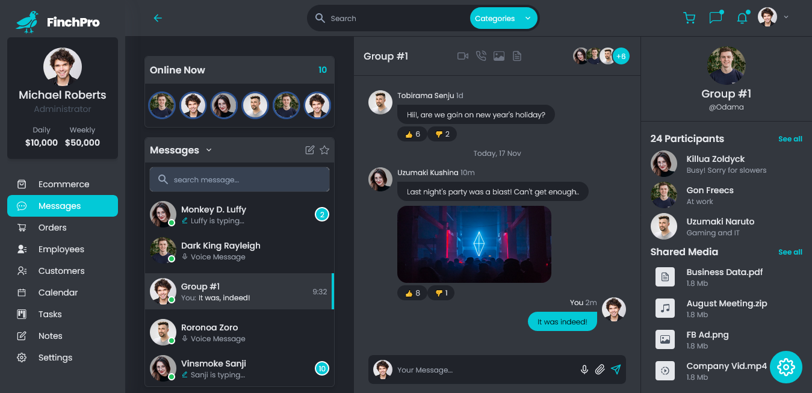

# FinchPro
  -Live Site URL: [https://finch-dashboard.netlify.app/](https://finch-dashboard.netlify.app/)

  -Admin dashboard react app that utilizes some of the great REACT UI components by Syncfusion. .
  
## Table of contents

- [Overview](#overview)
  - [Screenshot](#screenshot)
  - [Links](#links)
- [My Process](#process)
  - [Install Dependencies](#dependencies)
  - [Additional Info](#additional-info)
  - [Built With](#built-with)
- [Author](#author)

## Overview

### Screenshot






### Links

  -Live Site URL: [https://finch-dashboard.netlify.app/](https://finch-dashboard.netlify.app/)

## My Process

### Install Dependencies

```js
yarn add -D tailwindcss autoprefixer postcss

Add the following:
	@syncfusion/ej2": "^20.1.61",
    @syncfusion/ej2-react-calendars
    @syncfusion/ej2-react-charts
    @syncfusion/ej2-react-dropdowns
    @syncfusion/ej2-react-grids
    @syncfusion/ej2-react-inputs
    @syncfusion/ej2-react-kanban
    @syncfusion/ej2-react-popups
    @syncfusion/ej2-react-richtexteditor
    @syncfusion/ej2-react-schedule
    react-icons": "^4.4.0",
```

### Additional Info
---

### Built with

- Semantic HTML5 markup
- CSS custom properties
- Tailwind CSS
- ReactJS
- Vite

---
 
## Author

- Twitter - [@julfinch](https://www.twitter.com/julfinch)
